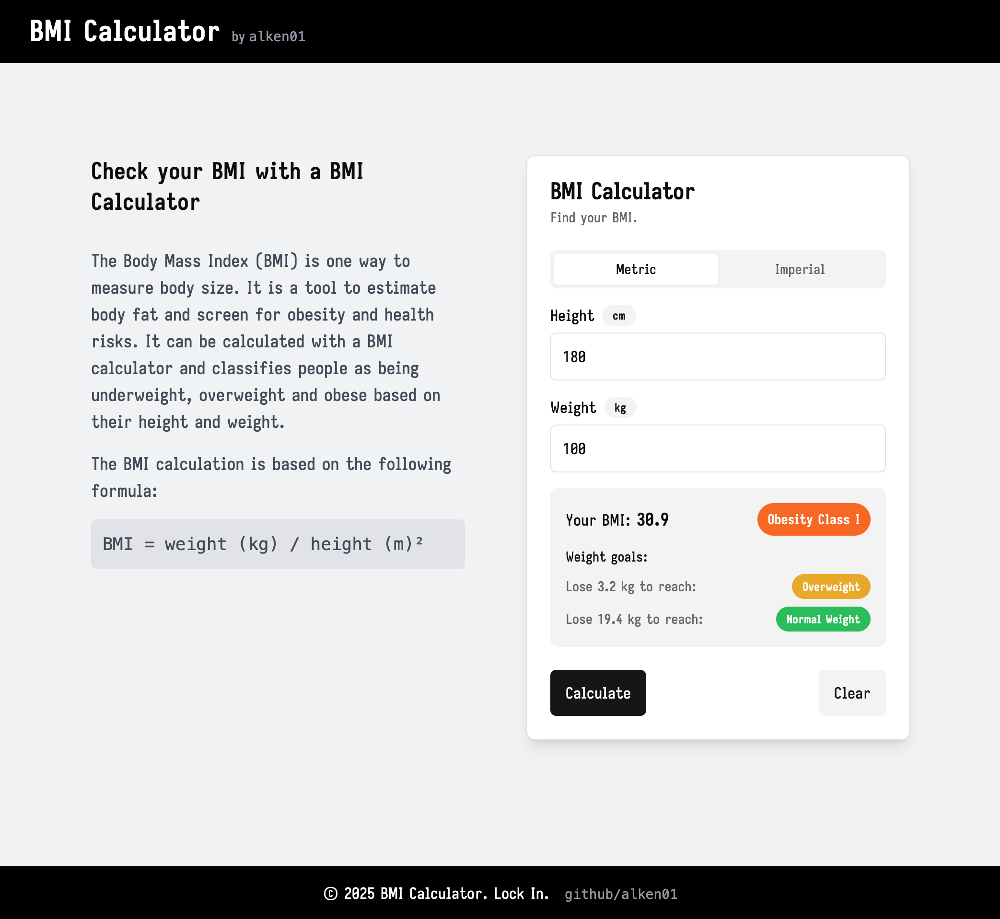
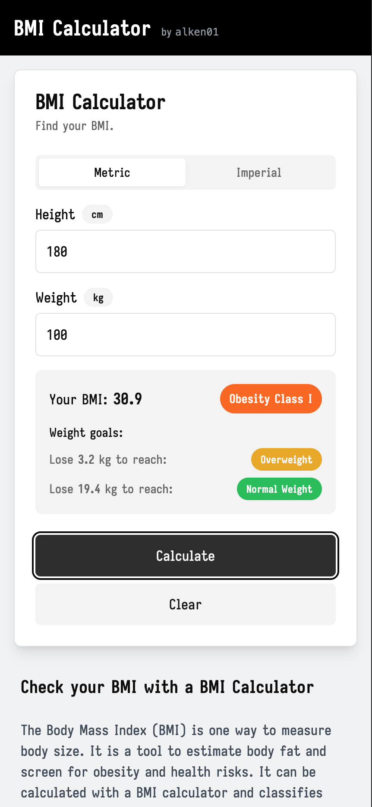

# BMI Calculator

A modern web application built with Next.js and TypeScript to calculate Body Mass Index (BMI) based on height and weight inputs. The calculator provides instant results along with a category classification of your BMI value. Built with shadcn/ui components for a clean, accessible interface.

## Live Demo

Try it out: [BMI Calculator](https://bmi-calculator-5m11.vercel.app/)

## Screenshots

<div style="display: flex; gap: 20px; align-items: flex-start;">
  
  
</div>

## Features

- Calculate BMI using metric (kg/cm) or imperial (lb/in) units
- Responsive design that works on desktop and mobile devices
- Instant BMI calculation and category classification
- Clean, user-friendly interface

## Tech Stack

- Next.js
- TypeScript
- Tailwind CSS
- shadcn/ui components
- Deployed on Vercel

## Installation

1. Clone the repository
   ```
   git clone https://github.com/alken01/bmi-calculator.git
   ```

2. Install dependencies
   ```
   npm install
   # or
   yarn install
   # or
   pnpm install
   ```

3. Run the development server
   ```
   npm run dev
   # or
   yarn dev
   # or
   pnpm dev
   ```

4. Open [http://localhost:3000](http://localhost:3000) in your browser

## How to Use

1. Select your preferred unit system (Metric or Imperial)
2. Enter your height and weight
3. View your BMI result and category instantly
